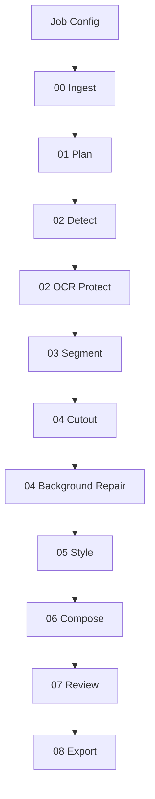

# Workflow

## End-To-End Flow

## Stage Responsibilities

### 00 Ingest

Copies the base image into the run directory and records source metadata.

Future upgrades:

- EXIF extraction.
- Color profile normalization.
- OCR pre-pass.
- Perceptual hash for cache/replay.

### 01 Plan

Normalizes the user request into a machine-readable element plan.

Future upgrades:

- VLM-based prompt parsing.
- Design-token extraction.
- Brand/style guide ingestion.

### 02 Detect

Finds candidate UI elements from the plan.

Current behavior:

- Uses manual rectangle selections when present.
- Uses lightweight local region proposals when `algorithms.detector = lightweight_detector`.
- For SVG inputs, extracts candidate boxes from SVG rectangles.
- For PNG/JPG inputs, uses edge/background differences and connected components.
- Falls back to deterministic placeholder boxes if lightweight detection cannot find candidate regions.
- Writes raster detection previews.

Future upgrades:

- YOLO26 for known UI classes.
- Grounding DINO for open-vocabulary detection.
- VLM region proposals for ambiguous UI semantics.

### 02 OCR Protect

Creates text protection regions before any replacement assets are generated.

Current behavior:

- Uses RapidOCR when `algorithms.ocr = rapidocr` and local OCR dependencies are available.
- Writes detected text boxes, recognized text, confidence, polygon points, and model metadata for real RapidOCR runs.
- Falls back to placeholder text locks if RapidOCR cannot run.
- In placeholder mode, writes text-region manifests from detected element boxes.
- Writes a raster text protection preview.
- Marks protected areas with `OCR LOCK TODO`.
- Compose restores these regions from the source image so placeholder generated assets do not cover them.

Future upgrades:

- PaddleOCR, docTR, or VLM OCR text detection.
- Text content extraction and regression checks.
- Text layer restoration and redraw.

### 03 Segment

Creates per-element mask metadata.

Current behavior:

- Writes placeholder mask manifests.
- Writes rectangular grayscale mask PNG files.
- Writes a raster mask preview.
- Tints the target region and labels it `INSTANCE SEG TODO` so users can see where a future instance segmentation model will act.

Future upgrades:

- SAM/SAM2 mask generation.
- YOLO-seg instance masks.
- Mask refinement and confidence scoring.

### 04 Cutout

Extracts target elements and prepares background repair metadata.

Current behavior:

- Creates cutout manifests.
- Creates transparent cutout PNG files from mask PNG files.
- Creates a cutout contact-sheet preview.

Future upgrades:

- Alpha matting.
- Edge feathering.
- Shadow separation.
- Inpainting request generation.

### 04 Background Repair

Creates background repair plans for areas exposed by cutouts.

Current behavior:

- Writes placeholder background repair manifests.
- Writes visible inpainting placeholder patch PNG files.
- Writes a raster background repair preview labeled `INPAINT TODO`.
- Compose can place repair placeholders before style assets.

Future upgrades:

- Real inpainting.
- Context-aware background reconstruction.
- Shadow and texture continuation.

### 05 Style

Creates replacement element artifacts.

Current behavior:

- Uses lightweight local style transfer when `algorithms.style = lightweight_style_transfer`.
- Applies reference-image or palette-driven color-statistics transfer to cutout PNG assets.
- Falls back to placeholder style assets if lightweight transfer cannot run.
- Writes a style asset contact-sheet preview.
- Creates placeholder style artifacts.
- Renders visible emoji/sticker markers into placeholder assets so users can distinguish future style-transfer output from a finished model result.

Future upgrades:

- ControlNet/IPAdapter/LoRA style transfer.
- ONNX fast neural style-transfer models.
- Parameterized UI control rendering.
- Asset-library replacement for icons.

### 06 Compose

Places generated elements back into the base image.

Current behavior:

- Records placeholder background repair patches but does not paste them into `final.png`.
- Alpha-composites styled PNG assets onto a raster base.
- Restores protected text regions from the source image.
- Writes `final.png`.
- Writes a composition preview.
- Skips placeholder background repair overlays in `final.png`; they remain visible only in debug previews and manifests.

Future upgrades:

- Layer-aware alpha compositing.
- Pixel-grid snapping.
- Text layer restoration.
- Lighting and color harmonization.

### 07 Review

Checks output quality and contract completeness.

Current behavior:

- Verifies basic artifacts and reports placeholder limitations.

Future upgrades:

- VLM visual review.
- OCR text preservation check.
- Layout overlap detection.
- Style consistency scoring.

### 08 Export

Writes a final run summary.

Future upgrades:

- PSD/layered PNG.
- Figma document.
- HTML/CSS reconstruction.
- Dataset records for training or evaluation.

## Retry Strategy

Stages should be retryable from their own inputs. When a stage fails or produces low confidence, later versions should repair the smallest possible scope:

- Detection issue: rerun detection for affected element prompts.
- Segmentation issue: rerun mask refinement only.
- Style issue: regenerate only the failed element.
- Composition issue: recompose without regenerating assets.
