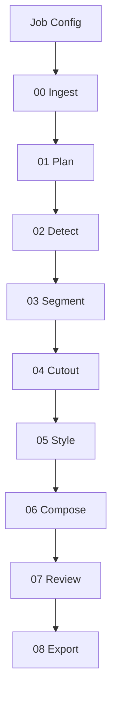

# Workflow

## End-To-End Flow

## Stage Responsibilities

### 00 Ingest

Copies the base image into the run directory and records source metadata.

Future upgrades:

- EXIF extraction.
- Color profile normalization.
- OCR pre-pass.
- Perceptual hash for cache/replay.

### 01 Plan

Normalizes the user request into a machine-readable element plan.

Future upgrades:

- VLM-based prompt parsing.
- Design-token extraction.
- Brand/style guide ingestion.

### 02 Detect

Finds candidate UI elements from the plan.

Current behavior:

- Creates deterministic placeholder boxes.

Future upgrades:

- YOLO26 for known UI classes.
- Grounding DINO for open-vocabulary detection.
- VLM region proposals for ambiguous UI semantics.

### 03 Segment

Creates per-element mask metadata.

Current behavior:

- Writes placeholder mask manifests.

Future upgrades:

- SAM/SAM2 mask generation.
- YOLO-seg instance masks.
- Mask refinement and confidence scoring.

### 04 Cutout

Extracts target elements and prepares background repair metadata.

Current behavior:

- Creates cutout manifests only.

Future upgrades:

- Alpha matting.
- Edge feathering.
- Shadow separation.
- Inpainting request generation.

### 05 Style

Creates replacement element artifacts.

Current behavior:

- Creates placeholder style artifacts.

Future upgrades:

- ControlNet/IPAdapter/LoRA style transfer.
- Parameterized UI control rendering.
- Asset-library replacement for icons.

### 06 Compose

Places generated elements back into the base image.

Current behavior:

- Copies the ingested base image as the final output.

Future upgrades:

- Layer-aware alpha compositing.
- Pixel-grid snapping.
- Text layer restoration.
- Lighting and color harmonization.

### 07 Review

Checks output quality and contract completeness.

Current behavior:

- Verifies basic artifacts and reports placeholder limitations.

Future upgrades:

- VLM visual review.
- OCR text preservation check.
- Layout overlap detection.
- Style consistency scoring.

### 08 Export

Writes a final run summary.

Future upgrades:

- PSD/layered PNG.
- Figma document.
- HTML/CSS reconstruction.
- Dataset records for training or evaluation.

## Retry Strategy

Stages should be retryable from their own inputs. When a stage fails or produces low confidence, later versions should repair the smallest possible scope:

- Detection issue: rerun detection for affected element prompts.
- Segmentation issue: rerun mask refinement only.
- Style issue: regenerate only the failed element.
- Composition issue: recompose without regenerating assets.

